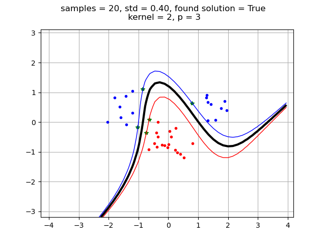
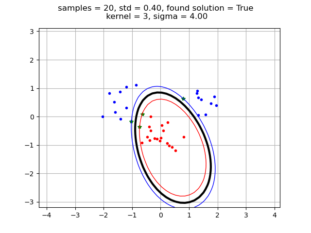

# Lab 2: Support Vector Machines (DD2421)
Sam Shahriari
2024-02-22

### Move the clusters around and change their sizes to make it easier or harder for the classifier to find a decent boundary. Pay attention to when the optimizer (minimize function) is not able to find a solution at all.
The linear SVM is bad at finding solutions when data points overlap in either the x1 or x2 plane. This can happen if standard deviation is too big or if one of the classes is split into two clusters. 

By removing one of the blue clusters

or lowering deviation

we instead get a positive result. The same effect would also occur if moving the clusters away from each other. Changing the size can improve accuracy but that more depends on randomness.

### Implement the two non-linear kernels. You should be able to classify very hard data sets with these.
We can now create an SVM for the example that did not work previously

### The non-linear kernels have parameters; explore how they influencethe decision boundary. Reason about this in terms of the bias-variance trade-off.
#### Polynomial kernel
By having an higher exponent we get an SVM that adapts more to the given dataset, leading to higher variance and lower bias. 

#### RBF
With the radial kernel the results seems to be the opposite. Higher sigma leads to higher bias and lower variance.

### Explore the role of the slack parameter C. What happens for very large/small values?
The slack parameter dictates how large of a penalty a point inside the margin will give. With a larger C the penalty will get bigger and thus the margin will be smaller.

### Imagine that you are given data that is not easily separable. When should you opt for more slack rather than going for a more complex model (kernel) and vice versa?
Here we have the bias variance trade off once again, also the type of data matters. If we for example have two classes where one class is in the middle of the other class,
a linear would not be able to properly classify the data despite allowing for much slack. If we on the other hand know that the dataset contains some noise, allowing slack would be able to mitigate that.