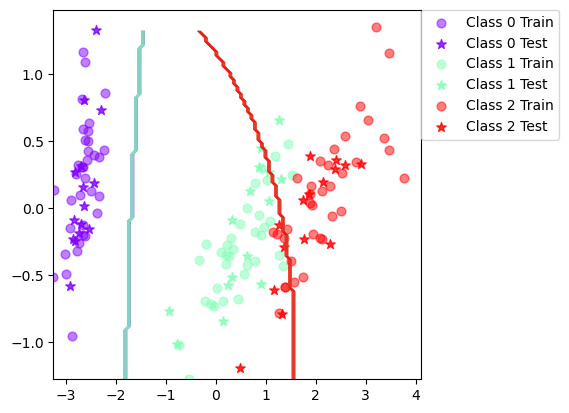
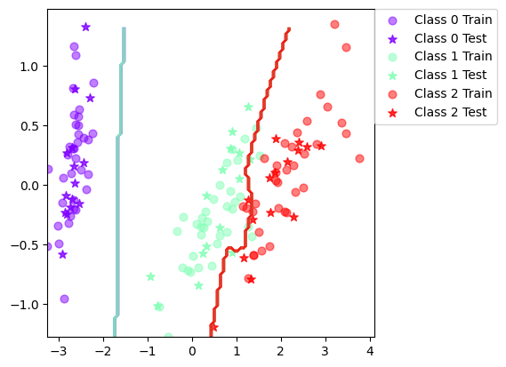
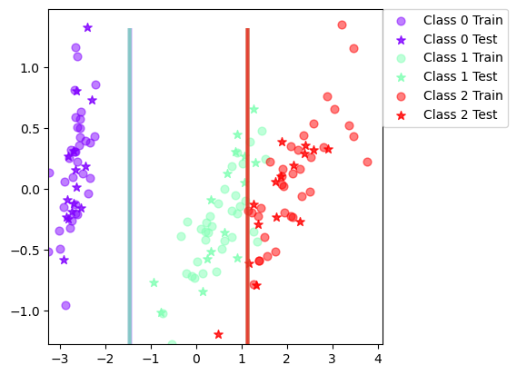
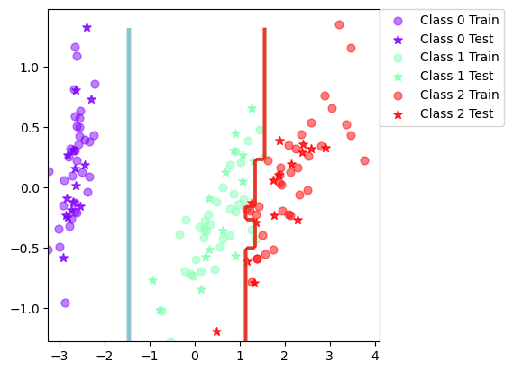

# Lab 3: Bayesian learning and boosting (DD2421)
Sam Shahriari
2024-03-04

### Naive bayes

### When can a feature independence assumption be reasonable and when not?

It can be reasonable when the features are nearly or compleatly uncorrelated. This is rarely the case I would say, eg weight and height.

### How does the decision boundary look for the Iris dataset? How could one improve the classification results for this scenario by changing classifier or, alternatively, manipulating the data?
- **Iris** Final mean classification accuracy  89 with standard deviation 4.16
- **Vowels** Final mean classification accuracy  64.7 with standard deviation 4.03

The classification could be improved by changing to a more advanced classifier that ha higher variance and lower bias. But by using some cross validation or boosting a better result could also be given.

## Boosted 

### Is there any improvement in classification accuracy? Why/why not?

- **Iris** Final mean classification accuracy  94.7 with standard deviation 2.82
- **Vowels** Final mean classification accuracy  80.2 with standard deviation 3.52

The classification accuracy has improved for both the datasets. It is especially significant for the vowel dataset. This is because points that were missclassified got a higher weight, meaning that the model should pay extra respect to these points for the next iteration.

### Plot the decision boundary of the boosted classifier on iris and compare it with that of the basic. What differences do you notice? Is the boundary of the boosted version more complex?

The new decision boundary is now more complex, it seems to be a combination of different lines instead of just one.

### Can we make up for not using a more advanced model in the basic classifier (e.g. independent features) by using boosting?

Yes, the results show that we get a higher accuracy compared to not using a booster. Altough, we do not have any data of how accurate a more complex classifier would be.

## Tree

### Is there any improvement in classification accuracy? Why/why not?
Iris:
- Before: Final mean classification accuracy  92.4 with standard deviation 3.71
- After: Final mean classification accuracy  94.6 with standard deviation 3.65

Vowel:
- Before: Final mean classification accuracy  64.1 with standard deviation 4
- After: Final mean classification accuracy  86.7 with standard deviation 2.68

The difference for Iris is not as signifacant as before. Vowel has improved even more.

### Plot the decision boundary of the boosted classifier on iris and compare it with that of the basic. What differences do you notice? Is the boundary of the boosted version more complex?

The boosted decision tree is much more complex now and has very low bias (over fitted).

### Can we make up for not using a more advanced model in the basic classifier (e.g. independent features) by using boosting?
Yes

## If you had to pick a classifier, naive Bayes or a decision tree or the boosted versions of these, which one would you pick? Motivate from the following criteria:

I would pick a decision tree if we want to achieve as good as possible on the following criteria, but it depends a lot on the data you have. If you have some knowledge about the dataset you can make a better decision.
- Outliers (As below)
- Irrelevant inputs: part of the feature space is irrelevant (It can find that it is irrelevant if the information gain for a split if non existent)
- Predictive power (Might be overfitted if no pruning method is used.)
- Mixed types of data: binary, categorical or continuous features, etc. (A decision tree can have some features categorical while other can be continuous)
- Scalability: the dimension of the data, D, is large or the number of instances, N , is large, or both (splitting the dataset makes it efficent to work with large data)